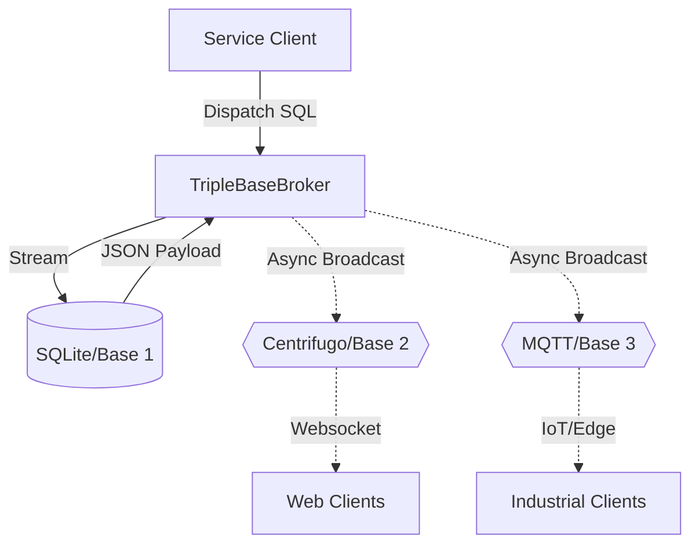

# 🌀 Vertigo (vortex-go)

[](https://golang.org)
[](LICENSE)
[](architecture.md)

**Vertigo** is a high-performance, resilient persistence bridge designed for industrial-grade Go services. It implements the **Triple Base Architecture** to decouple durable storage (SQL) from real-time networking (Websocket/Centrifugo) and industrial connectivity (MQTT), ensuring your service stays alive even when external brokers fail.

---

## 🚀 Why use Vertigo?

- **Triple Base Resilience**: Local persistence (Base 1) works independently of real-time broadcasting (Base 2/3).
- **Master Facade Pattern**: Simple API (`NewBroker` & `Dispatch`) hides complex DB pooling, MQTT clients, and Centrifugo logic.
- **Industrial Readiness**: Built-in **MQTT (Base 3)** for IoT and edge integration.
- **Zero-Copy Streaming**: Avoids RAM spikes by streaming SQL rows directly—ideal for massive datasets.
- **Selective Activation**: Enable or disable networking bases via `config.yaml` to run in "Air-gapped" or "Network-only" modes.

---

## 🏗 Architecture



---

## 🚥 Quick Start

### 1. Installation
```bash
go get vertigo/pkg/broker
```

### 2. Configuration
Copy the example config and adjust as needed:
```bash
cp config.yaml.example config.yaml
```

### 3. Initialize the Broker
```go
import "vertigo/pkg/broker"
import "vertigo/pkg/config"

func main() {
    cfg, _ := config.LoadConfig("config.yaml")
    v, err := broker.NewBroker(cfg)
    // ...
}
```

---

## 📡 Networking (Base 2)

### Centrifugo Setup
Vertigo uses **Centrifugo** as its real-time broadcasting engine. If you don't have it running, Vertigo will enter **Resilience Mode**.

**Run with Docker (Recommended):**
```bash
docker run -p 8010:8010 centrifuge/centrifugo centrifugo
```

### Resilience Mode & Troubleshooting
If you see a warning like: 
`Warning: Broker initialized with network error: failed to connect to Centrifugo...`

Don't worry! This means:
1. **Base 1 (Database)** is still fully functional.
2. **Base 2 (Network)** is automatically disabled/standby.
3. Your application will NOT crash; it just won't broadcast real-time updates until Centrifugo is online.

---

## 🧪 Demos

### 1. REST & GraphQL API (Main Demo)
The root `main.go` serves a modern API demo with GraphiQL.
```bash
go run main.go
```
- **Landing Page**: http://localhost:8080
- **GraphQL**: http://localhost:8080/graphql
- **REST**: `GET /api/users` & `POST /api/dispatch`
- **Postman**: Import `vertigo_demo.postman_collection.json`

### 2. CLI Demo
```bash
go run cmd/demo_cli/main.go
```

---

## 🔬 Testing

Run behavior-driven tests verified with Gherkin:
```bash
go test -v ./features/...
```

## 📄 License
Released under the MIT License.
