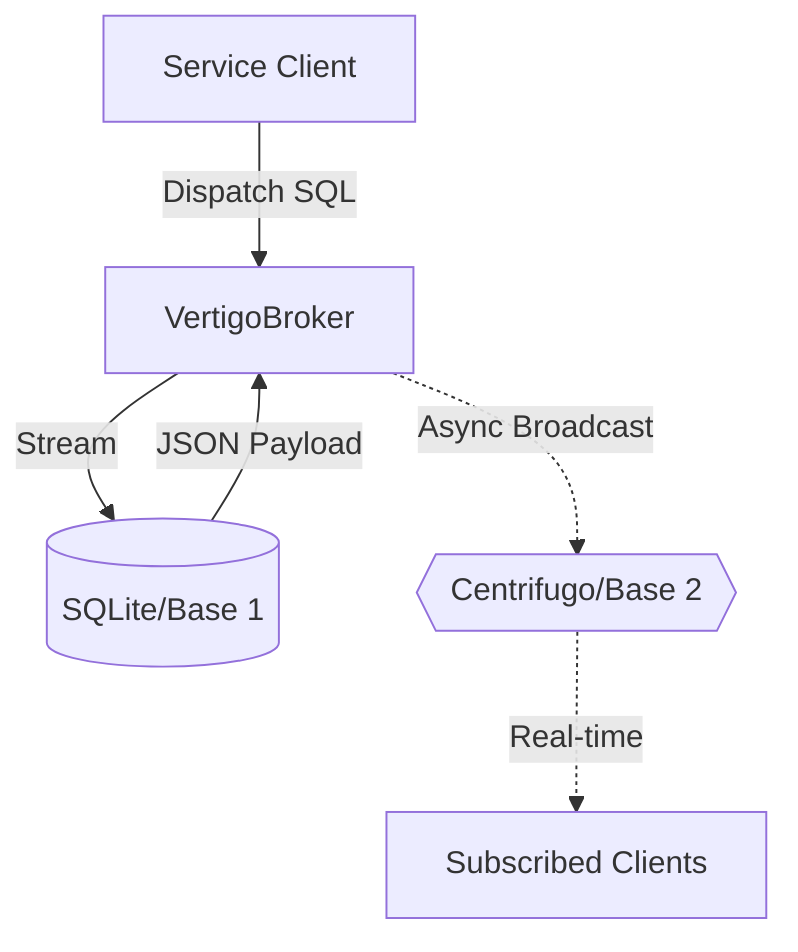

# 🌀 Vertigo (vortex-go)

[](https://golang.org)
[](LICENSE)
[](architecture.md)

**Vertigo** (formerly phgo) is a high-performance, resilient persistence bridge designed for industrial-grade Go services. It implements the **Double Base Architecture** to decouple durable storage (SQL) from real-time networking (Websocket/Centrifugo), ensuring your service stays alive even when the network fails.

---

## 🚀 Why use Vertigo?

- **Double Base Resilience**: Local persistence (Base 1) works independently of real-time broadcasting (Base 2).
- **Master Facade Pattern**: Simple API (`NewBroker` & `Dispatch`) hides complex DB pooling and network retry logic.
- **Zero-Copy Streaming**: Avoids RAM spikes by streaming SQL rows directly to JSON—ideal for 1,000,000+ records.
- **Raw SQL Dispatcher**: No need to write boilerplate queries. Just send SQL, get JSON.
- **Multi-Interface**: Built-in support for **REST** and **GraphQL** demos.

---

## 🏗 Architecture



---

## 🚥 Quick Start

### 1. Installation
```bash
go get vertigo/pkg/broker
```

### 2. Configuration
Copy the example config and adjust as needed:
```bash
cp config.yaml.example config.yaml
```

### 3. Initialize the Broker
```go
import "vertigo/pkg/broker"
import "vertigo/pkg/config"

func main() {
    cfg, _ := config.LoadConfig("config.yaml")
    v, err := broker.NewBroker(cfg.Database.Path, cfg.Network.CentrifugoURL)
    // ...
}
```

---

## 🧪 Demos

### 1. REST & GraphQL API (Main Demo)
The root `main.go` serves a modern API demo with GraphiQL.
```bash
go run main.go
```
- **Landing Page**: http://localhost:8080
- **GraphQL**: http://localhost:8080/graphql
- **REST**: `GET /api/users` & `POST /api/dispatch`
- **Postman**: Import `vertigo_demo.postman_collection.json`

### 2. CLI Demo
```bash
go run cmd/demo_cli/main.go
```

---

## 🔬 Testing

Run behavior-driven tests verified with Gherkin:
```bash
go test -v ./features/...
```

## 📄 License
Released under the MIT License.
